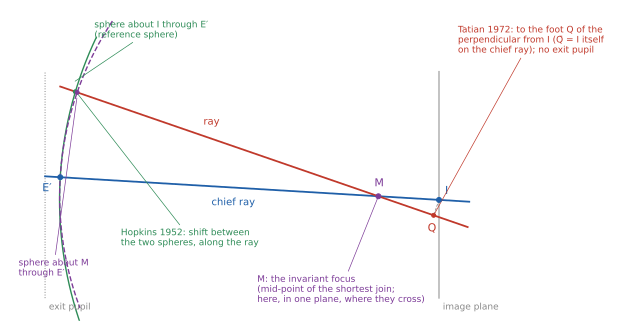
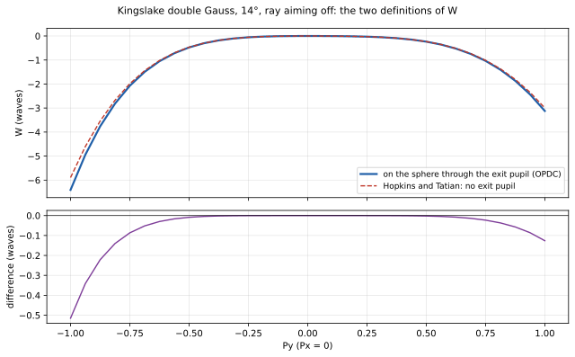

# Hopkins's surface contributions and Tatian's focal shift

WEC computes the wave aberration W three independent ways. The first sums optical paths ray by ray (`wec-method.md`). The second integrates Rayces's relation between wave and ray aberration, using only where the rays go in image space (`rayces-method.md`). This document describes the third: H. H. Hopkins's formula for what each surface adds to the aberration of a ray (1952), with the focal shift of B. Tatian's note on it (1972). It also explains what the comparison of the three methods shows: they agree to 10⁻⁸ wave or better whenever they are asked for the same quantity, but there are two common definitions of W, and those differ by up to a wave on ordinary lenses.

References: H. H. Hopkins, "The wave aberration associated with skew rays", *Proc. Phys. Soc. B* 65, 934 (1952). B. Tatian, "A comment on the wave aberration formula of H. H. Hopkins", *Optica Acta* 19, 79 (1972).

## 1. Hopkins's invariant foci

The optical-path difference between two rays depends on where it is measured: across a reference sphere, the difference changes as the light travels, unless the sphere is centred in the right place. Hopkins showed that for any two rays there is such a place: the mid-point of their shortest join, M. Measured to any sphere centred on M, the path difference between the two rays is the same on every wavefront. He called M an *invariant focus* of the pair. If the two rays meet, M is where they meet; for two skew rays it lies between them.

So the aberration Ω of a ray against the chief ray, referred to their invariant focus, has a meaning as exact as an optical path, and it does not depend on any reference sphere's radius or position.

## 2. What each surface adds (Hopkins 1952, eq. 7)

At each refracting or reflecting surface, Ω changes by

> **Δ(Ω) = Δ(N e),  e = Σ(λ + λ̄)(X − X̄) / (1 + Σλλ̄)**

- (X, Y, Z) and (X̄, Ȳ, Z̄) are the points where the ray and the chief ray meet the surface;
- λ, μ, ν and λ̄, μ̄, ν̄ are their direction cosines, the sums Σ running over the three components;
- Δ means the value after the surface (index N′, directions after refraction) minus the value before it (index N, directions before).

e is the difference of the two rays' distances from their points of incidence to the shortest join, so N e is an optical path. Summed over the surfaces, starting from zero in object space (both rays leave the same object point, or the same plane wavefront from an object at infinity), the result is Ω in image space.

Only the points of incidence and the directions enter: no path is summed, and the difference between the two rays is computed directly rather than as the small difference of two long paths. The formula assumes nothing about the surface's shape.

## 3. Referring Ω to the image point: two focal shifts



Ω is referred to M, which differs from ray to ray. A wavefront aberration for a field point is wanted against one point for every ray: the image point I, where the chief ray meets the image. Moving the reference from M to I is a focal shift, and there are two in the literature.

**Hopkins (1952, §4, eq. 13).** The reference sphere is centred on I and passes through E′, where the chief ray crosses the exit pupil. The shift is the optical path, along the ray, from that sphere to the sphere about M through the same E′. This makes Hopkins's W the same quantity as WEC's optical-path W on a reference sphere through the exit pupil (`wec-method.md` §2). Hopkins's closed form, eq. 13, drops the square of that distance between the spheres. That is an approximation, small on well-corrected lenses and growing with the aberration.

**Tatian (1972, eq. 1).** Tatian keeps Hopkins's surface formula, which he calls simple, universally applicable and exact, and replaces the focal shift. Following Luneburg's formulation of the diffraction integral, the aberration function is Hamilton's mixed characteristic, and the shift from M to I is

> **δW′ = −N (QD − Q̄D̄)**

with D, D̄ the ends of the shortest join and Q, Q̄ the feet of the perpendiculars from I to the ray and the chief ray. In coordinates, with (X, Y, Z) and (X̄, Ȳ, Z̄) any points of the two rays and X* those of I:

> **δW′ = −N { ΣX*(λ̄ − λ) + [Σλλ̄(ΣλX − Σλ̄X̄) + ΣλX̄ − Σλ̄X] / (1 + Σλλ̄) }**

No exit pupil enters. W is each ray's optical path to the foot of the perpendicular from I, which is a reference "sphere" of infinite radius: WEC's `ExitPupil=Infinite`, and OpticStudio's Reference OPD "Infinity" (`docs/verification.md`). Tatian notes that Hopkins's focal shift, besides being approximate, depends on the position of the exit pupil, and that the differences become more pronounced as the exit pupil approaches the image. For well-corrected lenses he expects very little difference between the two.

Tatian writes the focal shift for the ray's path minus the chief ray's. WEC uses the opposite sign (the chief ray's path minus the ray's, Hopkins and Welford's), so in WEC the shift enters with Tatian's sign reversed. Eliminating the shortest join, his eq. 1 can be written N [e(P, P̄) + λ·(I − P) − λ̄·(I − P̄)] for any points P, P̄ of the two rays. That form stays exact for rays nearly parallel to the chief ray, where the shortest join runs off to infinity.

## 4. Two definitions of W

The two focal shifts give two different quantities, each well defined:

| | Referred to | W measured along each ray to | In WEC |
|---|---|---|---|
| A | a sphere about I through the exit pupil | that sphere | `ExitPupil` = `RealChief`, `ParaxialChiefIntersect`, … |
| B | I, with no exit pupil | the foot of the perpendicular from I | `ExitPupil=Infinite` |

Hopkins's 1952 focal shift gives A; Tatian's gives B. OpticStudio's OPDC with its default Reference OPD, "Exit Pupil", is A with E′ on the paraxial exit pupil; its Reference OPD "Infinity" is B.



The two agree for small aberrations and part company as the aberration grows. Largest difference over the 857 OPDC points of a field, A being OPDC's sphere, ray aiming off:

| Lens | On axis | Largest field |
|---|---|---|
| Kingslake double Gauss | 2.5×10⁻⁴ wave (W 0.19) | 0.51 wave (W 5.9, 14°) |
| Cooke triplet | 1.2×10⁻² (W 1.3) | 2.5×10⁻² (W 3.5, 20°) |
| US8264785 | 9.4×10⁻⁵ (W 0.08) | 0.87 (W 2.9, 17.5°) |
| 1:1 relay | 1.4×10⁻² (W 2.0) | 1.3×10⁻² (W 3.6) |
| NA 0.3 objective | 8.8×10⁻³ (W 0.62) | 3.7×10⁻² (W 1.6) |
| `ShortPupilSinglet` (exit pupil 18 mm from the image) | 0.71 (W 3.2) | 1.05×10⁴ (W 2,095, 3°) |

The real and paraxial exit pupils give nearly the same A (on the double Gauss 0.51 and 0.51 wave from B; on US8264785 0.82 and 0.87): what separates the definitions is whether there is an exit pupil in them at all.

So a difference of the order of a wave between two calculations, one with each definition, at a few waves of aberration, does not show that either is in error. To compare a W with another, both have to be on the same definition.

## 5. How the three methods check one another

Each method computes W by a different route: optical path (`wec-method.md`), the rays' slopes in image space (`rayces-method.md`), and the surface-by-surface difference between the ray and the chief ray (this document). Asked for the same definition, they agree.

The table compares the Hopkins-Tatian W with the optical-path W, both on definition B, for the same rays: each entry is the largest difference between the two methods over the 857 points of every field of the lens. Differences of 10⁻¹¹ to 10⁻⁹ wave are at the level of rounding: the two methods give the same W.

| Lens | Largest W (waves) | Largest difference between the two methods (waves) |
|---|---|---|
| Kingslake double Gauss | 6.1 | 8.0×10⁻¹¹ |
| Cooke triplet | 3.7 | 8.8×10⁻¹⁰ |
| US8264785 | 5.4 | 6.5×10⁻⁹ |
| 1:1 relay | 3.6 | 1.9×10⁻¹⁰ |
| NA 0.3 objective | 1.6 | 1.5×10⁻¹⁰ |
| `FastSinglet` | 5,360 | 4.4×10⁻¹¹ |
| `FastSinglet_Defocused` | 5,683 | 4.5×10⁻¹¹ |
| `ShortPupilSinglet` | 2,095 | 3.7×10⁻¹¹ |

Tatian's eq. 1 in coordinates agrees with the same shift taken from the shortest join's own geometry to 2×10⁻¹⁰ wave. With Hopkins's own focal shift instead, onto the sphere through the real exit pupil (A, `RealChief`): taken exactly it agrees with the optical path to between 3×10⁻¹¹ and 6×10⁻⁹ wave; eq. 13 as printed, without δ², is off by 4.5×10⁻⁴ wave on the double Gauss (W 6.4), 7.5×10⁻⁵ on the Cooke triplet, 1.2×10⁻² on US8264785 (W 2.9), 3.5×10⁻⁵ on the relay and objective, and tens to hundreds of waves on the singlets with a thousand. The Rayces integration agrees with the optical path on A to 10⁻⁹ wave (`rayces-method.md`).

## 6. Limits

- Centred systems: the surfaces' frames are assumed to differ only by a shift along the axis. A tilted or decentred surface is refused.
- Not afocal. Tatian treats an image at infinity separately (a reference point chosen near the lens, his note added in proof); that is not implemented.
- The indices are taken unsigned with the directions the light actually travels, so a mirror needs no special case; none of the test lenses has one, so mirrors are untested here.

## 7. Using it

```
wfe hopkins KingslakeDG.zmx --preset Zemax
wfe hopkins KingslakeDG.zmx --preset Zemax --1952 --set ExitPupil=RealChief
```

The first gives, per field, Hopkins-Tatian against the optical path with the infinite reference, the closed form of Tatian's eq. 1 against the shortest join, the largest |W|, and the largest difference from the preset's own sphere through the exit pupil. The second uses Hopkins's own focal shift onto the sphere the options name, exactly and as printed, against the optical path on that sphere. `--csv` writes every point.
