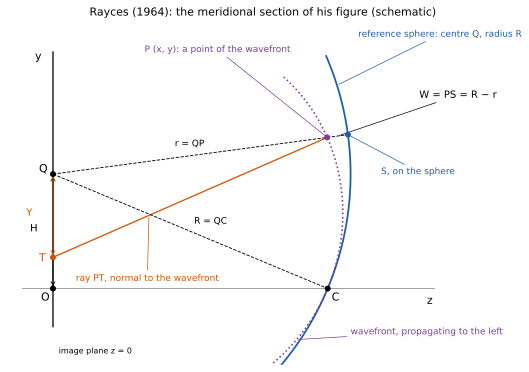
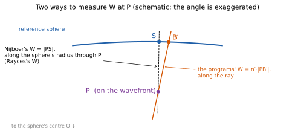
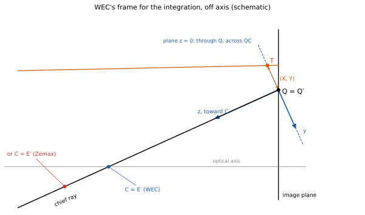
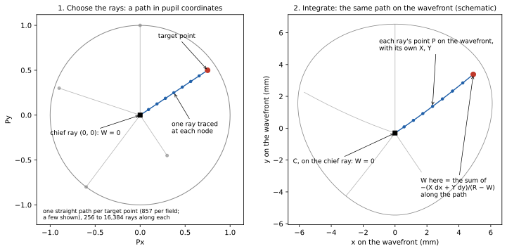
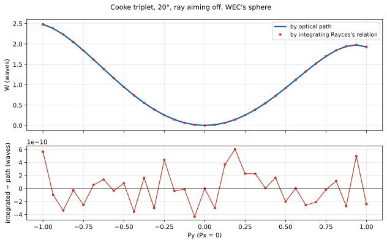
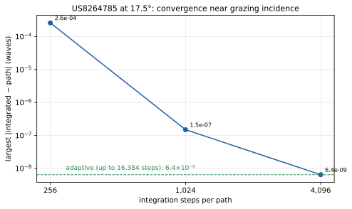

# The wavefront from the ray aberrations: Rayces's method

The usual way to compute a wave aberration sums optical path along each ray (the companion document, *How WavefrontErrorCalculator computes the wavefront*). There is a second way that uses no optical path at all: integrate the wavefront's slope, which the rays' transverse aberrations give exactly. J. L. Rayces showed in 1964 that the relation between the two is exact, not the first-order approximation of the textbooks. This document explains his relation, how WavefrontErrorCalculator (WEC) integrates it, and what it shows.

> J. L. Rayces, "Exact relation between wave aberration and ray aberration", *Optica Acta* **11**, 85–88 (1964).

## 1. The relation

The textbook relation between the wave aberration W and the transverse ray aberration (X, Y) is

> ∂W/∂x = −X/R,  ∂W/∂y = −Y/R

where R is the radius of the reference sphere. It is an approximation; Wolf (1952) showed its error is of seventh order for symmetric systems. Rayces derived the exact form:

> **∂W/∂x = −X/(R − W),  ∂W/∂y = −Y/(R − W)**

The approximation follows by neglecting W beside R. It becomes exact when the pupil is at infinity (a telecentric system), as Toraldo di Francia pointed out.

## 2. Rayces's geometry

The relation holds only with the terms defined exactly as Rayces defines them:

- **Q** is the centre of the reference sphere, an image point near the Gaussian image. It lies on the y-axis, at height H in the image plane z = 0.
- **C** is the centre of the exit pupil, on the z-axis. The wavefront and the reference sphere touch there. R = QC.
- **P** is a point of the actual wavefront, with coordinates (x, y). The ray through P is normal to the wavefront there.
- **T** is where that ray meets the image plane: T = (X, H + Y, 0). (X, Y) is the transverse ray aberration, measured from Q in the plane z = 0.
- **r = QP** is the distance from the sphere's centre to the wavefront point.
- **W = R − r** is the wave aberration, measured along the sphere's radius through P, from P to the sphere at S. This is Nijboer's definition. Its physical meaning is the phase at Q: the waves arriving at Q from the points of the wavefront differ in phase by 2π/λ times W.

## 3. Why it is exact

Rayces writes the wavefront two ways and differentiates. The four quantities x, y, z and r are tied by Pythagoras:

> x² + (y − H)² + z² − r² = 0

and the wavefront is a surface z = f(x, y), or, eliminating z, r = g(x, y). Differentiating both and requiring the ray to be the wavefront's normal, with direction ratios (x − X)/z and (y − H − Y)/z from the figure, gives

> ∂r/∂x = X/r,  ∂r/∂y = Y/r

Since r = R − W, ∂r/∂x = −∂W/∂x, which is the relation. No term is dropped anywhere, so it is exact for any wavefront and any position of Q.

## 4. Two meanings of W

Rayces's W (Nijboer's) runs from P along the sphere's radius. The W that optical design programs report runs along the ray: the optical path from the wavefront to the sphere at the ray's own crossing B′. The two are tied exactly by the geometry of P, the sphere and the ray. With r = |QP| = R − W_Nijboer, and θ the angle at P between the ray and the radius QP,

> W_along-ray = | √(R² − r² sin²θ) − r cos θ |

(times n′, in optical path). For small θ and W ≪ R this is W_along-ray ≈ W_Nijboer·(1 + θ²/2): the two differ by about ½·W·θ². The angle is θ ≈ ε/R, where ε is how far the ray misses Q, so the difference grows with the square of the transverse aberration and with the inverse square of the distance from the exit pupil to the image. Checked ray by ray on the lenses below, the exact relation holds to 10⁻¹¹ wave.

Measured on the test lenses at the 857 points, aiming off: up to 6.3×10⁻⁵ wave on US8264785 and 1.9×10⁻⁵ on the double Gauss at full field, 1.2×10⁻⁶ on the Cooke triplet, and 10⁻⁷ on the relay and the objective.

**When the exit pupil is close to the image** the two diverge, as the formula says. Constructed lenses show it (a fast singlet of f = 50 mm, EPD 40, and the same singlet with its stop near the image, at f/5):

| Lens | R | Largest θ | Largest W (waves) | Largest W_along-ray − W_Nijboer (waves) |
|---|---|---|---|---|
| Kingslake double Gauss, 14° | 105 mm | 0.14° | 6.4 | 1.8×10⁻⁵ |
| f/1.25 singlet, 10° | 54 mm | 14° | 1,332 | 40 (3%) |
| singlet, stop near the image, 3° | 18 mm | 32° | 3,928 | 685 (17%) |

Both are legitimate definitions of the wave aberration, and they agree whenever the rays meet the sphere nearly along its radius. With the pupil at infinity (telecentric image space) θ is zero and they coincide.

**The along-ray W is the one that matters for image formation.** The diffraction integral that gives the image (Hopkins; Born & Wolf, ch. 9) needs the phase of the wave on the reference sphere. The phase at a point of the sphere is the optical path along the ray that reaches it, from the wavefront to the sphere: that is the along-ray W. Nijboer's W, measured along the sphere's radius, is a geometric construction under which Rayces's relation is exact; it is not the phase on the sphere, and equals it only to second order in θ. So the along-ray W is the quantity to report, and the integration is converted to it (section 6) before it is compared.

**Neither method is the reference for the other.** Rayces's relation is exact, and the optical-path sum is exact; each is correct for its own definition of W. The integration's value is that it is independent: it uses only the rays' directions after the lens and never adds up a path length, so the two share nothing but the ray trace. Neither can be more accurate than that trace. Where the two definitions differ, as on the lenses in the table, that is a difference of definition, not an error in either method: converted to the along-ray W, the integration on the 3,928-wave lens agrees with the optical-path value to 7×10⁻¹¹ wave.

On ordinary lenses, whose exit pupil is far from the image, that is negligible: 6×10⁻⁵ wave is about λ/16,000, and for designing or judging such a lens the two definitions are interchangeable (not so with the pupil close to the image, as above). On the test lenses it matters only for the check in this document, which compares two methods that agree to 10⁻⁹–10⁻¹⁰ wave. Left unconverted, the difference in definition would be some ten thousand times larger than that agreement and would hide it: the comparison would show up to 6×10⁻⁵ wave and look like a failure, when both methods are right and simply measure W along different lines. So WEC integrates Nijboer's W, then converts at each point: it follows the ray from P to the sphere, and n′ times that distance is the along-ray W.

## 5. Off axis, and other reference spheres

Rayces's derivation needs only two things of the axes: Q on the y-axis and C on the z-axis, with X and Y measured in the plane z = 0 through Q. WEC takes:

- **Q at the origin** and the **z-axis along Q→C**. Then H = 0, and the plane z = 0 is the plane through Q perpendicular to QC.
- **X and Y** are where each ray crosses that plane, relative to Q.

This works for any reference sphere whose point C is on the chief ray, so the same code serves WEC's own sphere (C where the real chief ray crosses the optical axis) and Zemax's (C where the chief ray crosses the paraxial exit-pupil plane). Off axis the frame is tilted from the lens's own axes, as in the figure.

## 6. Integrating it

Rayces's relation gives the slope of W at every point of the wavefront. To get W itself at a point, WEC adds up the slope along a path on the wavefront, starting from the one point where W is known: C, on the chief ray, where W = 0.

> dW = −(X dx + Y dy)/(R − W)

This is a line integral over the wavefront coordinates (x, y). X and Y are the integrand: they set the slope at each point. Any path from C to the point gives the same W, because the slopes come from one function.

None of the quantities in it are pupil coordinates; all are lengths in image space:

| Symbol | What it is | Units |
|---|---|---|
| x, y | the coordinates of the point P on the actual wavefront | mm |
| dx, dy | the change in P's coordinates from one ray to the next | mm |
| X, Y | the transverse ray aberration: where the ray crosses the plane through Q, measured from Q | mm |
| R, W | the reference sphere's radius, and the wave aberration | mm |

So W comes out as a length, and is turned into waves at the end by multiplying by n′/λ.

**Why the path is chosen in the pupil.** A point of the wavefront cannot be picked directly: the only thing that can be done is to trace a ray, and a ray is chosen by its pupil coordinates (Px, Py). So the path is laid out in the pupil, as the straight line from the chief ray, (0, 0), to the target point, and rays are traced at evenly spaced nodes along it. Each of those rays lands on its own point P of the wavefront, with its own X and Y. The straight line in the pupil thereby becomes a path on the wavefront, generally a little curved, and the integral runs along that.

The figure shows five straight paths from the chief ray; the number has no significance. Since W depends only on the point, not on the path to it, the paths can be shared. WEC integrates one line along the meridional axis (Px = 0), and from it one row of constant Py out each way through the targets in that row. Each line is integrated once, a segment at a time, from one target to the next, so every target on it costs only the rays of its own segment: 256 per unit of pupil length to begin with, at least 16 to a segment. A lens's vignetted pupil is symmetric about the meridional plane and convex, so a row from the axis to a target whose ray passes stays among rays that pass. Giving each target its own straight path from the chief ray, as in the figure, takes five to seven times as long on the test lenses and gives the same largest difference, to four figures, on every one. WEC keeps it as an option (`--radial`), and as the fallback for a target a shared line does not reach.

The steps:

1. **Rays:** trace the rays at evenly spaced nodes along the path, and keep only each ray's line in image space: a point and a direction. No optical path is used.
2. **Transverse aberration:** for each ray, (X, Y) where it crosses the plane through Q across QC.
3. **The wavefront point:** P lies on the ray at distance R − W from Q. P therefore depends on W itself, so the integration is a differential equation, not a plain integral.
4. **The step:** the implicit trapezoidal rule, iterated at each node until W and P agree. The rule is symmetric, so its error is a series in even powers of the step.
5. **Romberg extrapolation:** the same integral with 1/8, 1/4, 1/2 and all of the nodes, combined to cancel the error terms in h², h⁴ and h⁶.
6. **Adaptive refinement:** the last extrapolation's change, summed over the segments of a target's path, estimates the error. Where it exceeds 10⁻¹⁰ wave, the point is done again with four times the nodes, up to 16,384 per unit of pupil length. A point still above it gets its own straight path with the nodes closer together toward it, spaced as 1 − (1 − u)² for evenly spaced u. That is for a pupil that ends at total internal reflection rather than at an aperture: there the slope of W goes as one over the square root of the distance to the edge, which evenly spaced nodes cannot follow, and in u it is smooth.
7. **Convert:** from Nijboer's W to the along-ray W (section 4).

## 7. Results

The integrated W against WEC's optical-path W, at the 857 pupil points of every field (on axis and two off-axis fields per lens), largest difference in waves:

| Lens | Conjugate | Aiming off | Aiming real |
|---|---|---|---|
| Kingslake double Gauss | infinite | 1.1×10⁻¹⁰ | 9.1×10⁻¹¹ |
| Cooke triplet | infinite | 1.1×10⁻⁹ | 1.1×10⁻⁹ |
| US8264785 | infinite | 6.9×10⁻⁹ | 7.3×10⁻⁹ |
| 1:1 relay, NA 0.1 | finite | 2.6×10⁻¹⁰ | 3.4×10⁻¹⁰ |
| 5× objective, NA 0.3 | finite | 1.3×10⁻¹⁰ | 1.3×10⁻¹⁰ |

These hold on WEC's reference sphere and on Zemax's alike.

US8264785 at 17.5° has a zone near grazing incidence where W climbs steeply toward the rim. There the integration needs many nodes: with 256 the difference is 2.6×10⁻⁴ wave, with 1,024 1.5×10⁻⁷, with 4,096 6.4×10⁻⁹. Beyond that it stops falling, and the same few 10⁻⁹ appears on axis. So it is not the integration's error; most likely it is the ray trace's precision on the lens's aspheres, the only aspheres among these lenses.

## 8. What it shows

The optical-path method and the integration share nothing but the ray trace. One adds up n·length along each ray to a sphere; the other uses only the rays' directions after the lens, and never adds a length. That they agree to 10⁻⁹ wave on every lens, on axis and off, at infinite and finite conjugates, means the per-ray W values are exact to that level. The integration is a check, not a higher authority: both methods rest on the same ray trace, and their agreement confirms both. And since Zemax's OPDC and LensHH-LT agree with WEC to 10⁻⁸ wave once WEC uses their reference sphere, their values are confirmed to the same level.

Without it, the evidence for those values would be agreement between programs, and programs can agree and still share an error: the same convention for the reference sphere, the same pupil location, the same treatment of finite conjugates. Agreement shows they are consistent; it does not show they are correct. The integration does, because it reaches W by a different road. A mistake in the reference sphere, the pupil, or the path sum would show up as a disagreement with it, as large as the mistake.

The tool is `wfe rayces <lens> --points <result.json>` (WEC), and the test is `RaycesTests`.

## 9. Where the method is useful

The integration needs where the rays go, and nothing of the optical path. So it is the method wherever the rays' directions are known and the phase is not, and the independent check wherever the phase is known.

**Measurement: the instrument sees slopes, not phase.** This is its main use in the world.

- **Shack–Hartmann and Hartmann sensors** measure the displacement of spots, which are transverse ray aberrations, and find the wavefront by integrating them.
- **Ocular aberrometry.** Ray-tracing aberrometers (Tscherning's kind) and Hartmann sensors for the eye measure where rays land on the retina.
- **Deflectometry** measures the slopes of a mirror, a freeform or a windshield, and integrates them to its shape.
- **The classical tests**, Ronchi, knife-edge and the Hartmann screen, give ray deviations, and turning them into a wavefront is the same integration.

There the slopes are all there is, and integrating them is the only way to the wavefront.

**Ray data without a phase.**

- **Programs that do not keep the optical path.** Illumination and non-sequential programs, renderers and simple tracers often give rays as a position and a direction only, as in a source ray file. The integration gives their wavefront.
- **Diffractive optics, holograms and metasurfaces described by their local deflection.** When an element is given by its local grating period or deflection angle, the rays' directions are known but its phase may not be; integrating the directions recovers it.
- **Gradient index.** A GRIN trace keeps the optical path as a numerical integral along a curved ray. The integration uses only the directions leaving the medium, so it checks that integral independently.

**Checking optical-path programs.** This is the use in section 8, and it matters most for a design program. The optical-path method has its conventions to get right: the reference sphere, the pupil, finite conjugates, vignetted rays. Programs can agree with one another and share an error. The integration reaches W by another road, so any such error shows as a disagreement with it. It is the one independent check of OPD there is.

**Theory.** The relation is the exact link between transverse and wave aberration that the textbook ∂W/∂x = −X/R approximates. It turns ray aberration coefficients, such as Buchdahl's, into wave aberration exactly, and it says when the approximation fails: when W is not small beside R. That takes a sphere close to the image or a very large aberration; on the short-pupil lens of section 4, W reaches about 13% of R.

The exact form, with R − W in place of R, changes little in most measurements: a sensor typically sees a few micrometres of W over tens of millimetres of R, so W/R is 10⁻⁴ or less. Integrating the slopes is valuable everywhere; its exactness matters in extreme geometries, as in section 4, or for a check at 10⁻⁹ wave.

**Where it does not hold: anisotropic media.** In a birefringent crystal, a calcite polarizer or stressed plastic, the ray's direction and the wavefront's normal part, and integrating the ray directions gives the wrong wavefront; the wave normals would have to be used instead. In isotropic media, gradient index included, it holds exactly, because the rays are the wavefronts' normals (the theorem of Malus and Dupin).

For a lens design program, then, its uses are the check of OPD and bringing in wavefronts measured by a sensor or ray data from programs without the phase. For designing a lens the optical-path method remains the tool: it gives the same W with a single ray per point.
