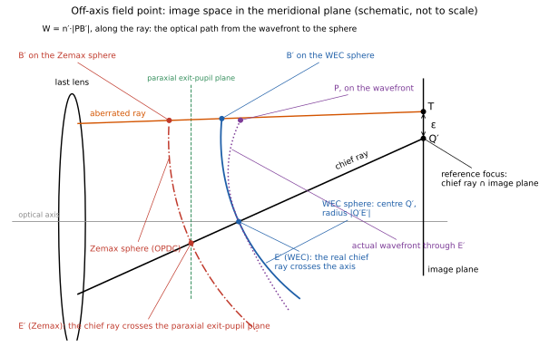
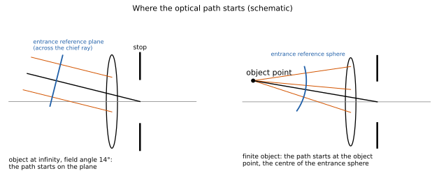
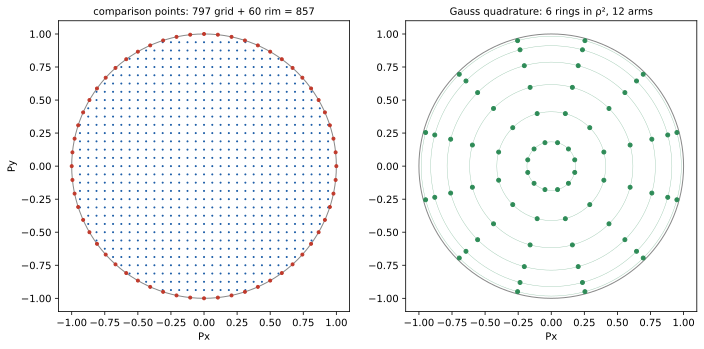
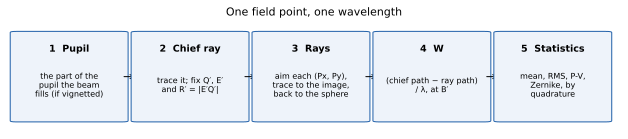
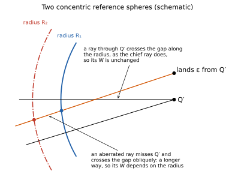
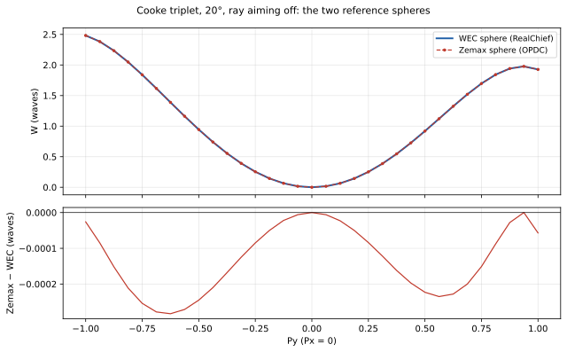

# How WavefrontErrorCalculator computes the wavefront

WavefrontErrorCalculator (WEC) computes the wave aberration of a lens from real rays, one ray at a time, by optical path. This document explains the method with diagrams, for an off-axis field point, where everything that distinguishes one program's convention from another shows up. The full specification is `docs/method.md`; the checks against other programs are in `docs/verification.md`.

## 1. What is computed

For one field point and one wavelength, every ray through the pupil gets a number W, its wave aberration: how far, in optical path, the ray is ahead of or behind a perfect spherical wave converging on the image point. WEC follows Hopkins (1981) and Welford (1986):

> **W = [chief ray's optical path to the reference sphere] − [the ray's optical path to the reference sphere]**

- Optical path is Σ n·(geometric length), summed surface to surface in double precision.
- W is positive when the ray's path is shorter than the chief ray's, that is when the wavefront is ahead of the reference sphere (the Hopkins/Welford sign).
- W is reported in waves of the vacuum wavelength.

Everything rests on the **reference sphere**: its centre Q′ and the point E′ it passes through. The rest of this document is about how those are chosen and how a ray is carried to the sphere.

## 2. The off-axis geometry

The figure shows image space for an off-axis field point, in the meridional plane:

- **The chief ray** passes through the centre of the stop. In image space it lands on the image plane at **Q′**, the reference focus: the centre of the reference sphere.
- **The exit pupil point E′** is where the sphere meets the chief ray. WEC's default, `RealChief`, takes the point where the real chief ray crosses the optical axis: the real exit pupil for that field (Hopkins 1981, eq. 4.31). Zemax's OPDC takes the chief ray's crossing of the paraxial exit-pupil plane instead (`ParaxialChiefIntersect`). On axis the two coincide. Off axis the real chief ray does not cross the axis where the paraxial pupil plane is, because of pupil aberration, so the two points differ.
- **The reference sphere** has centre Q′ and radius R′ = |E′Q′|. The two choices of E′ give two concentric spheres of different radius.
- **An aberrated ray** misses Q′: it lands at T, a transverse aberration ε from Q′. Followed back from the image plane, it crosses each sphere at its own point B′.
- **The actual wavefront** is a surface of constant optical path. The one drawn passes through E′, where it touches the sphere. Along the ray, W is n′ times the distance from the wavefront to the sphere.

## 3. From the object to the reference sphere

Each ray's optical path is measured between two reference surfaces:

- **Entrance:** centred on the object point. For a finite object it is a sphere, so the path starts at the object point itself. For an object at infinity, as in the figure, it is a plane across the collimated beam, perpendicular to the chief ray's direction. Every ray of the beam crosses it with the same phase, so the constant it adds cancels in W.
- **Exit:** the reference sphere of section 2.

The ray is traced through the lens surface by surface to the image plane, accumulating n·length on every segment. From its landing point I and direction d, it is then carried along its own line, backwards or forwards, to the reference sphere: the root of |I + t·d − Q′|² = R′² nearest E′, in a numerically stable form. Its path to the sphere is the path to the image plane plus n′·t.

## 4. Choosing the rays

A ray is named by its pupil coordinates (Px, Py): its point in the entrance pupil, as a fraction of the pupil radius. How the ray is aimed at that point is a convention:

- **Unaimed** (WEC's `RayAiming` value `Paraxial`): the ray is launched at that point of the paraxial entrance pupil. This is OpticStudio's ray aiming **Off**.
- **Aimed at the real stop** (`RealStop`): WEC finds the launch that makes the ray cross the real stop at (Px, Py) times the stop radius. For a finite object the radius is that of the axial beam from the object point. This is OpticStudio's ray aiming **Real**.

OpticStudio has a third setting, ray aiming **Paraxial**. It is not the same as WEC's value of that name, and it has not been tested: every comparison here is with ray aiming Off or Real.

For the point-by-point comparisons WEC uses 857 points per field: a grid of spacing 1/16 inside the unit circle and 60 points on its rim (left). For pupil statistics it integrates exactly instead (right): Gauss–Legendre nodes in ρ² on rings and evenly spaced arms. Each node carries the area its rays fill on the exit sphere, found from four extra rays a small step either side of it. This gives the RMS wavefront to about 10⁻¹⁰ wave, where a 64×64 grid is off by 10⁻².

## 5. The steps, in order

1. **Pupil:** if the field is vignetted, find the part of the pupil the beam fills.
2. **Chief ray:** trace it, and fix the reference geometry: Q′, E′ and R′.
3. **Rays:** aim and trace each pupil point to the image plane, then carry it to the sphere.
4. **W:** the chief ray's path minus the ray's path, in waves.
5. **Statistics:** mean, RMS and P-V, Zernike coefficients, by quadrature or on the sample's own weights.

## 6. Why the reference sphere matters

Two spheres with the same centre but different radii give the same W for every ray that passes exactly through the centre: each such ray travels the same extra distance between the spheres as the chief ray does. An aberrated ray misses the centre, crosses the gap at an angle, and travels a little further. Its W therefore changes with the radius, by an amount that grows as the square of its transverse aberration.

So the difference between WEC's sphere and Zemax's is largest where the lens is most aberrated: at the edge of the field and the rim of the pupil.

On the Cooke triplet at 20° the two differ by up to 2.8×10⁻⁴ wave along the tangential line, and 7.9×10⁻⁴ over the whole pupil, against a wavefront of several waves. With E′ switched to Zemax's choice (and the primary wavelength's sphere used at every wavelength), WEC reproduces Zemax's OPDC and LensHH-LT's to about 10⁻⁸ wave.

## 7. The conventions, in one place

| Switch | WEC default | Zemax OPDC | What it decides |
|---|---|---|---|
| `ReferenceCenter` | `ChiefRay`: chief ray ∩ image | the same | centre Q′ of the sphere |
| `ExitPupil` | `RealChief`: real chief ray ∩ axis | `ParaxialChiefIntersect` | the point E′, so the radius |
| `RayAiming` | as the program being matched | Off (WEC `Paraxial`) or Real (`RealStop`); OpticStudio's Paraxial setting not tested | which ray a pupil point names |
| `ChromaticReference` | `PrimaryFocus`: each wavelength to its own focus | `PrimarySphere` | the sphere at other wavelengths |
| `Sign` | Hopkins: chief − ray | the same | the sign of W |

Presets set these together: `Reference` (the defaults), `Zemax`, `ZemaxZernike`, `Optiland` and `LensHHLT`; OSLO is reproduced by setting its switches one by one. Each reproduces its program at every pupil point (`docs/verification.md`).

## 8. How we know it is right

- **Exact cases:** a paraboloid on axis, a sphere imaging its centre of curvature and the aplanatic points of a sphere give W = 0 to below 10⁻⁶ wave.
- **Other programs:** under their own conventions WEC reproduces Zemax OpticStudio's OPDC to 6×10⁻⁸ wave, LensHH-LT to 2×10⁻⁸, Optiland to 2×10⁻⁸ and OSLO to 1×10⁻⁸, at 857 points per field on five lenses: three at infinite conjugates and two finite, on axis and off.
- **An independent method:** integrating Rayces's exact relation between wave and ray aberration gives the same W from the rays' directions alone, without any optical path, to 10⁻⁹ wave or better (7×10⁻⁹ on US8264785's aspheres). The companion document explains it.
